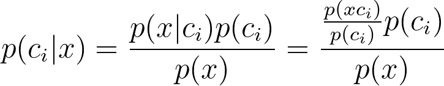
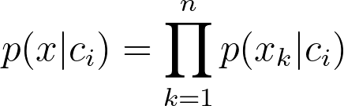
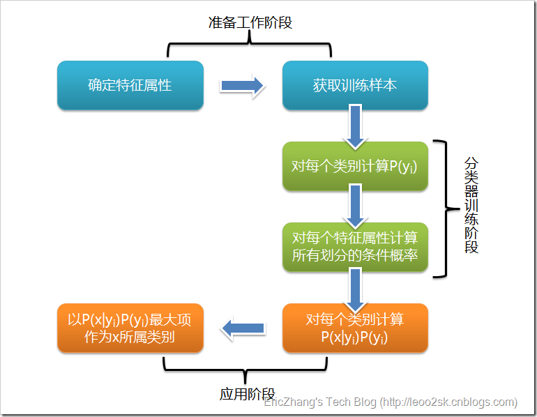

# 朴素贝叶斯

基于概率论的分类算法, 有着坚实的数学基础及稳定的分类效率. 该模型所需参数很少, 对缺失数据不太敏感(仍然有效).
但由于其假设属性之间相互独立, 而这在现实中极难保证. 因此实际上的误差率较理论上大.
    - 朴素贝叶斯假设特征独立, 且每个特征同等重要
        - naive: 朴素贝叶斯中朴素一词的含义. 整个形式化过程中只做最原始、最简单的假设.

优缺点:
- 优点: 在数据较少的情况下仍然有效, 可以处理多类别问题
- 缺点: 对于输入数据的准备方式较为敏感

适用标称型数据

## 算法理论

贝叶斯准则: 交换条件概率中的条件与结果, 可由已知概率值来计算未知概率值
- 
    - 公式中假设样本特征之间相互独立, 则将样本特征展开: p(x|c) = p(x1|c) * p(x2|c)...

贝叶斯是根据概率去分类的: 
- 如果p(c1|x) > p(c2|x), 那么类别属于c1, 否则属于c2

贝叶斯分类器通常有两种实现方式:
* 基于贝努力模型实现
* 基于多项式模型实现 

### 朴素贝叶斯分类的工作过程
* 设D是训练元组和它们相关联的类标号的集合。每个元组用一个n维属性向量X={x1,x2,...,xn}表示。
* 假定有m个类C1 ,C2,...Cm。给定元组X，分类法将预测X属于具有最高后验概率的类。也就是说，
朴素贝叶斯分类法预测X属于类Ci，当且仅当 
    * P(Ci|X)>P(Cj|X)     1≤j≤m, j≠i
    * 这样，P(Ci|X)最大的类C1称为最大后验概率。根据贝叶斯定理
        - 
* 由于P(X)对所有类为常数，所以只需要P(Ci|X)P(Ci)最大即可。若类的先验概率未知，则通常假定这些类是等概率的，
即P(C1)=P(C2)=...=P(Cm)，并据此对P(Ci|X)最大化，
否则最大化P(Ci|X)P(Ci)
* 给定具有很多属性的数据集，计算P(Ci|X)的开销非常大。为了降低计算开销，可以做类条件独立的朴素假定。给定元组的类标号，
假定属性值有条件地相互独立。因此，
    * 
    * 考察该属性是分类的还是连续值的，例如为了计算P(X|Ci)，考虑如下两种情况：
        * 如果Ak是分类属性，则P(|Ci)是D中属性Ak的值为xk的Ci类的
        元组数除以D中Ci类的元组数|Ci,D|
        * 如果Ak是连续值属性，则假定连续值属性服从均值为η、标准差为σ的高斯分布，由下式定义：
            - 
            * 即P(xk |Ci)=g(xk,ηci,σci)
* 为了预测X得类标号，对每个类Ci，计算P(Ci|X)P(Ci)。该分类法预测输入元组X的类为Ci，
当且仅当，P(X|Ci)P(Ci)>P(X|Cj)P(Cj)， 
1≤j≤m, j≠i。即是，被预测的类标号是使P(X|Ci)P(Ci)最大的类Ci

拉普拉斯校准（laplace）:
- 当P(xk|Ci)=0怎么办，当某个类别下某个特征项没有出现时就出现这种现象，这时会出现的情况是：尽管没有这个零概率，
仍然可能得到一个表明X属于Ci类的高概率。有一个简单的技巧来避免该问题，可以假定训练数据库D很大，以至于对每个计数加1
造成的估计概率的变化可以忽略不计。但可以方便地避免概率值为0.这种概率估计计数称为拉普拉斯校准或拉普拉斯估计法

####  <small>example流程:</small>

- 收集数据: 本章是用RSS源
- 准备数据: 数值型或者bool型
- 分析数据: 大量特征时, 绘制特征作用不大, 使用直方图效果更好
- 训练算法: 计算不同的独立特征的条件概率
- 测试算法: 计算error rate
- 使用算法: 常用文档分类, 任意的分类场景也可使用. 具体使用具体分析

## 示例
* [朴素贝叶斯恶意留言过滤](../Code/Chapter4_Bayes/test_bayes.py)
* [垃圾邮件过滤](../Code/Chapter4_Bayes/test_bayes_use.py)
* 

## 资料
*[朴素贝叶斯分类](https://www.cnblogs.com/luonet/p/4028990.html)

