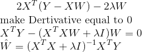
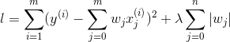
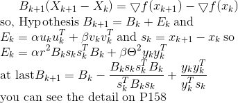

# 岭回归和Lasso回归

都是针对最小二乘法不适合处理特征之间具有相关性的情况, 且都属于正则化的特征选择方法.

## 岭回归模型

岭回归是在方差的基础上增加正则项, 损失函数为: , 其中λ>0.
通过确定λ的值可以使得在方差和偏差之间达到平衡: 随着λ的增大, 模型方差减小而偏差增大.
 从公式直观的来看, 该模型的解会偏向于较小的w, 从凸优化的角度来看, 最小化该公式等价于: 
, 其中C是和λ一一对应的常数.

也就是说, 我们通过限制w的大小实现了对模型空间的限制, 从而在一定程度上(取决于λ的大小)避免了overfitting
, 不过由于Ridge Regression并不具有产生稀疏解的能力, 得到的稀疏w仍然需要数据中的所有特征才能计算预测结果, 
从计算量上来说并没有得到改观.

利用最小二乘法求解岭回归模型的参数时, 首先对W求导, 结果为: 
 

 

## Lasso回归模型
Lasso仍然是一个convex optimization问题, 不过不再具有解析解.它的优良性质是能产生稀疏性, 导致w中许多项变成零.

Lasso采用L1正则, 即Lasso是在平方差的基础上增加L1正则, 损失函数为:
 

, 其中λ>0 
由于该损失函数在wj=0处不可导, 因此基于梯度下降的方法不适合该损失函数求解, 
因此使用以下近似的优化算法来求解

## BFGS和L-BFGS

- BFGS(拟牛顿法)
    - BFGS校正公式为:  

 

## 杂谈

[系统讲解回归区分较好的笔记](https://blog.csdn.net/hzw19920329/article/details/77200475)