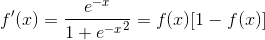
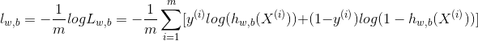
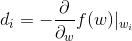
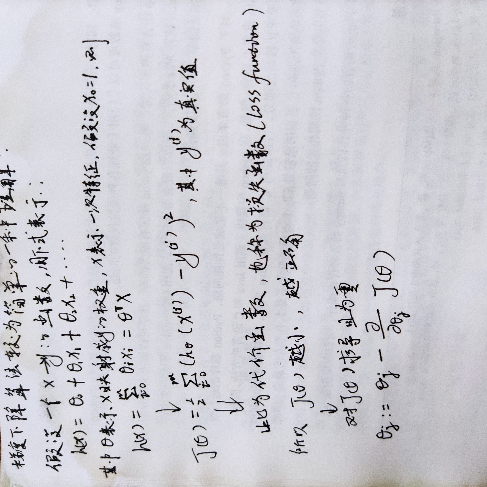

# Logistic Regression(逻辑回归)
适合二分类问题

## Logistic Regression模型
- 是广义线性模型的一种, 属于线性的分类模型.
- 超平面: 一条能够将两个类区分的直线, 公式为Wx + b = 0 (w为权重, b为偏置, 多维情况下W和b都为向量)
- 阈值函数: 将样本映射到不同的类别中, 常见的有sigmoid函数, 公式: 
 

 
 Sigmoid的值域为(0,1), 其导函数为: 
 

 

### 求解模型的两个参数W和b， 须先定义损失函数
[损失函数定义](https://blog.csdn.net/wjlucc/article/details/71095206)及算法推导.
损失函数公式为: 
 

 
 为求得损失函数lw,b的最小值, 可以使用基于梯度的方法进行求解. 

- 梯度下降法(Gradient Descent, GD)
    - 优点:
         只需求解损失函数的一阶导数, 计算成本小
    - 含义:
         通过当前点的梯度方向寻找新的迭代点, 并从当前点移动到新的迭代点继续寻找新的迭代点, 直到找到最优解.
    - 具体步骤(对于优化问题min f(w)):
        - 随机选择一个初始点w0
        - 重复以下过程
            - 决定梯度下降的方向: 
            - 选择步长α
            - 更新wi+1 = wi + α·di
            - 直到满足条件为止
    - 凸优化和非凸优化
        - 最小二乘(Least Squares)、 岭回归(Ridge Regression)、逻辑回归的损失函数都是凸优化问题
        - 凸优化: 全局只存在一个最优解
        - 非凸优化: 全局存在多个局部最优解
    - 步长α选择很重要
 

    
## 其他
[LR讲解较细的一篇文章](https://blog.csdn.net/programmer_wei/article/details/52072939)