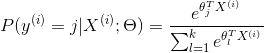
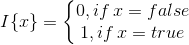
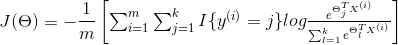
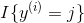

# Softmax Regression

它是Logistic Regression算法在多分类问题上的推广(其中, 任意两个类之间是线性可分的)

## 损失函数

对于m个训练样本, k个特征的数据, 先用假设函数为每一个样本估计其所属的类别的概率:
 

 
其中Θ表示的向量, 且Θi∈Rn+1, y(i)∈{0,1,....,k}, 则每一个样本估计其所属类别的
概率为:
 

 

类似于LR算法, 在Softmax Regression算法的损失函数引入指示函数I(·), 
 

 
 Softmax Regression的损失函数为: 
 

 
 其中, 表示的是当y(i) 属于第j类时, 
 = 1, 
否则  = 0.

## Softmax Regression与Logistic Regression

SR中存在着参数冗余的问题(部分参数没有任何用处), 模型中存在多种最优解

LR是SR的特征情况, 即当k=2时的情况.

## 杂谈
- [LR详解](https://blog.csdn.net/caimouse/article/details/60578247)