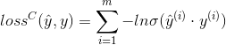
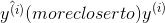
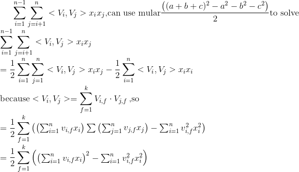
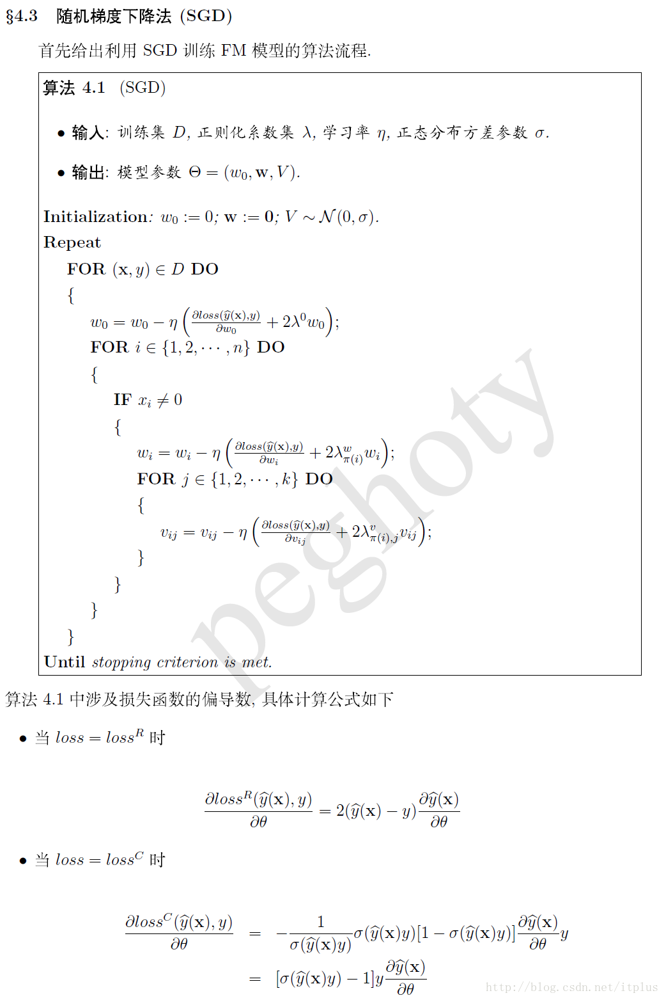

# Factorization Machine

## 前言
可处理以下三类问题:
- 回归问题(Regression): 损失函数可取为 最小平方误差
- 二分类问题(Binary Classification): 损失函数可取为logit loss函数
- 排序(Ranking)

## 主要优点
- 用于高度稀疏数据场景
- 具有线性的计算复杂度

## FM机器学习
[公式推导及引入交叉项的原因](https://blog.csdn.net/itplus/article/details/40534923)

- 损失函数(二分类因子分解机FM算法)
[logit loss公式](https://blog.csdn.net/google19890102/article/details/79496256):
 

 
其中σ(x) 为sigmoid函数, 由公式可知 损失函数就越小

- 引入交叉项:
 

 

- 模型的求解:
 

 

## 随机梯度下降(Stochastic Gradient Descent)
SGD算法步骤

SGD针对数据量特别大的情况, 由于梯度下降算法使用所有的样本进行模型参数的学习, 需花费大量的计算成本.
因此, 提出SGD简化计算, 提高效率

特点: 在每次迭代过程中, 仅根据一个样本对模型中的参数进行调整. 每次迭代只是考虑让该样本点的J(θ)
趋向最小, 而不管其他的样本点. 这样算法会很快, 但是收敛过程会比较曲折, 整体上只能接近局部最优解, 
而无法真正达到局部最优解.

对loss function公式求导: 

## 其他
[FM详解](https://blog.csdn.net/liruihongbob/article/details/75008666)
[比较好的算法原理详解(含采样数据处理)](https://blog.csdn.net/itplus/article/details/40536025)
