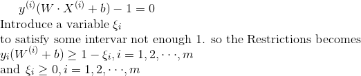
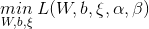
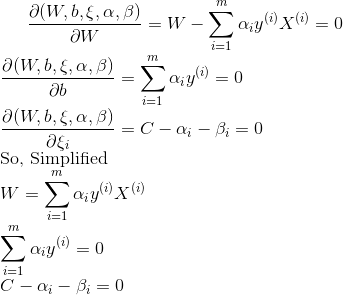
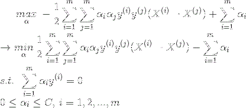
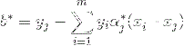
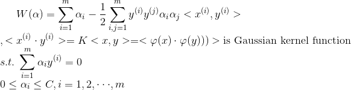

# 支持向量机(Support Vector Machine)

## 前言
- 与分割超平面距离最近的样本称为支持向量(Support Vector)
- 在确定最终的分隔超平面时, 只有支持向量起作用, 其他的样本点并不起作用.

核心思想: 将低维数据线性不可分映射成高纬度数据成为线性可分

## 感知机算法

直接使用通误分类的样本到分隔超平面之间的距离S作为损失函数, 并利用梯度下降法求得
误分类的损失函数的极小值, 得到分隔超平面.

样本到分隔超平面的距离为: 
 

  
其中||W||为W的L2范式, [L2范式详解](https://blog.csdn.net/zchang81/article/details/70208061)

感知机算法的损失函数为: 

感知机算法存在的问题: 采用不同的初始值或者不同的分类点, 最终产生的分隔超平面是不同的.

## SVM算法

SVM解出的分隔超平面不仅能够正确划分训练数据集, 而且几何间隔最大.

训练样本中, 与分隔超平面距离最近的样本称为支持向量(Support Vector), 在确定最终的分隔超平面中, 只有支持向量
起作用, 因此这类模型被称为支持向量机.

### 函数间隔与几何间隔

#### 函数间隔(Functional Margin)

当预测值W·X(i)+b和样本标签y(i)同号时, 表明最终的分类是正确的.

定义分隔超平面有关样本点的函数间隔为: , 
因此定义分隔超平面为求所有样本点至分隔超平面的函数间隔最小值

函数间隔可以表示分类预测的正确性和准确性

#### 几何间隔(Geometrical Margin)

函数间隔中当W和b变化时, 函数间隔也跟着变化. 因此引入几何间隔, 实际上是在函数间隔的基础上加上了均一化操作.
 

 

### 推导步骤

支持向量的约束条件(其实就是几何距离大于或等于支持向量到超平面的几何距离): 
 

 
引入松弛向量ξi的目的是为了解决部分线性不可分的样本不满足大于或等于1的约束条件

#### 引入拉格朗日乘数法解决最优问题求解, 将原始的带约束的优化问题转换成其对偶问题.
- 1/||W||的最大值问题相当于1/2 ||W||2
- 对偶问题往往更容易求解
- 可以自然的引入核函数, 进而推广到非线性分类问题

公式: 
 

 
, 向量α和β为拉格朗日乘子向量.(对于非支持向量α都是等于0的, 因为非支持向量对超平面无影响)

拉格朗日对偶问题, 最小优化问题即变为: 
 

 
利用对偶性, 对换max和min的位置(由于α为不等式约束, 带有α的去求解w,b,ξ过于难).先固定α求解
, 分别求导得:
 

 
- 将上述结果代入至, 得到:
 

 
- 再对求α的极大, 即可求得最优的α,就可求出权重W
 

 
- 求解b的最优解时, 公式: 

#### 由线性支持向量机到非线性支持向量机(引入核函数)

引入高斯核函数解决非线性支持向量机问题
- 核函数通过将数据映射到高维空间, 来解决在原始空间中线性不可分的问题
 

,
ψ是从X到内积特征空间F的映射 

之所以不先映射再根据内积的公式计算,而是采用核函数的原因是:
- 前一种在高维中计算, 计算复杂度指数级增长
- 后一种直接在原来的低维空间计算, 而不需要显示的写出映射后的结果

序列最小最优化算法SMO(Sequential Minimal Optimization)求解: 书69页
- 思想: 将一个大的问题划分成一系列小的问题, 通过对子问题的求解, 达到对对偶问题的求解过程

## 杂谈
- [SVM算法详解](https://blog.csdn.net/v_july_v/article/details/7624837)
- [支持向量机学习笔记](https://blog.csdn.net/v_victor/article/details/51508884)
