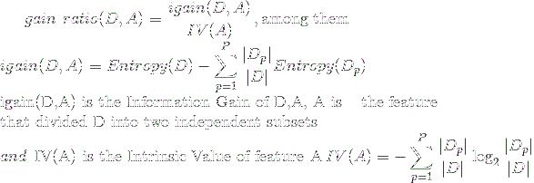
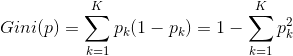
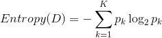

# 随机森林(Random Forest)

## 前言
集成学习(Ensemble Learning): 选择训练多个分类模型, 并将各自的预测结果组合起来得到最终的预测.
- Bagging(Bootstrap Aggregating)算法: 
    - Random Forest(bagging算法中最重要的一种算法): 决策树(Decision Tree)
    - 对训练样本有放回的抽取, 由此产生多个训练数据的子集
- Boosting算法
    - 通过顺序地给训练集中的数据项重新加权创造不同的基础学习器.
    - 初始时所有数据都会初始化同一个权重, 每次训练迭代后,正确划分的数据项权重会被降低, 错误划分的数据项权重会增大.

## 决策树算法
决策树算法的一些标准
- 信息增益(Information Gain): 划分前后信息熵的减少量称为信息增益, 代表: ID3决策树算法
- 增益率(Gain Ratio): 可以作为最优划分属性的方法, 代表: C4.5决策树算法,公式:
 

 
- 基尼指数(Gini Index): 越小样本纯度越高, 代表: CART决策树算法, 公式: 

熵(Entropy)是度量样本集合纯度最常用的一种指标(越小说明纯度越高), 公式: 

### 主要的一些算法
ID3算法(分类树)
- 以信息论为基础, 以信息熵和信息增益为衡量标准, 从而实现对数据的归纳分类. 
    建立在奥卡姆剃刀的基础上: 越是小型的决策树越优于大的决策树(be simple理论)
    
- 核心思想: 以信息增益度量属性选择, 选择分裂后信息增益最大的属性进行分裂.

- 算法缺陷
    - 没有剪枝过程, 为了祛除过渡数据匹配的问题, 可通过裁剪合并相邻的无法产生大量信息增益的叶子节点.
    - 信息增益的方法偏向选择具有大量值的属性, 也就是说某个属特征索取的不同值越多, 
    那么越有可能作为分裂属性, 这样是不合理的.
    - 只可以处理离散分布的数据特征.

- 算法步骤
    - 初始化属性集合和数据集合
    - 计算数据集合信息熵S和所有属性的信息熵, 选择信息增益最大的属性作为当前决策节点
    - 更新数据集合和属性集合(删掉上一步中使用的属性, 并按照属性值来划分不同分支的数据集合)
    - 依次对每种取值情况下的子集重复第二步
    - 若子集只包含单一属性, 则分支为叶子节点, 根据其属性值标记
    - 完成所有属性集合的划分

C4.5算法(分类树): 采用PEP剪枝法
- 是ID3算法的一种改进, 改进的地方有:
    - 用信息增益率来选择属性, 克服了用信息增益选择属性偏向选择多值属性的不足
    - 在构造树的过程中进行剪枝
    - 对连续属性进行离散化
        - 将需要处理的样本(对应根节点)或样本子集(对应子树)按照连续变量的大小从小到大进行排序
        - 假设该属性对应不同的属性值共N个, 那么总共有N-1个可能的候选分割值点, 
        每个候选的分割阈值点的值为上述排序后的属性值中两两前后连续元素的中点
        - 用信息增益选择最佳划分
    - 能够对不完整的数据进行处理
    
CART算法(分类回归树)
- CART算法较于ID3算法、C4.5算法不仅能够处理分类问题, 也可以处理回归问题. 
基于Gini, 节点越纯, Gini越小
- 算法步骤:
    - 对于当前训练数据集, 遍历所有属性及其所有可能的切分点, 寻找最佳切分属性及其最佳切分点, 使得切分之后的基尼指数最小,
    利用该最佳属性及其最佳切分点将训练数据切分成两个子集, 分别对应判别结果为左子树和判别结果为右子树.
    - 为每一个叶子节点寻找最佳切分属性及其最佳切分点, 将其划分为左右子树(重复此步骤直至满足停止条件)
    - 生成CART决策树
- [CART树回归](../Part2-Regression/Chapter9-CART-Regression.md)

## 决策树杂谈

###  停止分裂的条件
- 最小节点数: 当节点数据量小于一个指定的数量时, 不再继续分裂
    - 数据量较少时，再做分裂容易强化噪声数据的作用
    - 降低树生长的复杂性, 提前结束分裂一定程度上有利于降低过拟合的影响

- 熵或者基尼值小于阈值
    - 熵和基尼值的大小表示数据的复杂程度，当熵或者基尼值过小时，表示数据的纯度比较大，
    如果熵或者基尼值小于一定程度数，节点停止分裂
    
- 决策树的深度达到指定的条件
    - 节点的深度可以理解为节点与决策树跟节点的距离, 当深度到达指定的上限大小时，停止分裂

- 所有特征已经使用完毕, 不能继续进行分裂

### 决策树的优化
一颗过于复杂的决策树很可能出现过拟合的情况, 优化的方法主要有两种, 一是剪枝, 二是组合树

### 剪枝
两种方案
- 先剪枝: 提前结束决策树的增长
- 后剪枝: 在决策树生长完成后再进行剪枝的过程

剪枝方法
- REP-错误率降低剪枝: 根据错误率进行剪枝, 如果一颗子树修剪前后的错误率没有下降, 就可以认为该子树是可以修剪的
(注意REP需要使用新的数据集, 旧的数据集不可能出现分裂后的错误率比分裂前错误率要高的情况)

- PEP-悲观剪枝: 如果决策树的精度在剪枝前后没有影响的话, 则进行剪枝(剪枝后的误差小于剪枝前精度的上限, 
则说明剪枝后的效果跟剪枝前的效果一致, 此时要进行剪枝)[算法详情](http://www.cnblogs.com/yonghao/p/5064996.html)

- CCP-代价复杂度剪枝: 选择节点表面误差率增益值最小的非叶子节点，删除该非叶子节点的左右子节点，若有多个非叶子节点的
表面误差率增益值相同小，则选择非叶子节点中子节点数最多的非叶子节点进行剪枝

## 随机森林算法(Random Forest)
基于Bagging的集成学习方法. 由一系列的决策树组成, 通过自助法(Bootstrap)重采样技术, 有放回的抽取训练数据生成多个分类树, 
从而组成随机森林.

### 算法流程
参数: 构建的决策树个数ntree, 决策树每个节点进行分裂时需要考虑的输入特征的个数k
(k通常取为log2n(其中n为原数据集中特征的个数))

- 

## 杂谈
- [几种决策树算法及实例](http://www.cnblogs.com/yonghao/p/5122703.html)