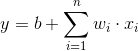
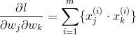
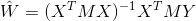
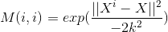

# 线性回归(Linear Regression)

## 前言

线性回归算法是很多算法的基础, 但对于样本之间存在很高的相关性, 基本线性回归算法很难得到泛化能力较高的模型

线性回归算法是一种全局的回归算法, 对局部的拟合效果并不好

## 线性回归

线性回归方程: , 其中b为偏置, wi为回归系数

损失函数: 有绝对损失函数和平方损失函数, 由于平方损失处处可导, 因此通常使用平方误差作为线性回归模型的损失函数.
公式为: 
 

, 求解希望得到平方误差的最小值 

### 最小二乘法

又称最小平方法是一种数学优化技术, 通过最小化误差的平方和寻找数据的最佳函数匹配.利用最小二乘法可以简便地求得未知的数据, 
并使得这些求得的数据与实际数据之间误差的平方和为最小

对于多个特征中有特征之间是高度相关的, 最小二乘法估计不适合, 偏差过大.

### [牛顿法](https://blog.csdn.net/google19890102/article/details/41087931)

牛顿法也是一种优化算法, 利用迭代点xk处的一节导数(梯度)和二阶导数(Hessen矩阵)对目标函数进行二次函数近似, 然后
 把二次函数的极小点作为新的迭代点, 并不断重复这一过程, 直至求得满足精度的近似极小值. 
 优点是: 下降速度比梯度下降的快, 而且能高度逼近最优值.
 
#### 基本的牛顿法

- 基于导数的算法, 每一步的迭代方向都是沿着当前点函数值下降的方向. 对于一维的情形f(x)(求解问题为f＇(x)=0), 
对f(x)进行泰勒展开到二阶, 得到
- 需要初始点足够"靠近"极小点, 否则, 有可能导致算法不收敛
    
#### 全局牛顿法

损失函数: 假设有m个训练样本, 其中, 每个样本有n-1个特征, 则线性回归模型的损失函数为:
 

, 其 
- 一阶导数为: 

- 二阶导数为:

基本流程
- 1.给定终止误差值0≦ε<<1, δ∈(0,1), σ∈(0,0.5), 初始点x0∈Rn, 令k=0
- 2.计算gk=▽f(xk), 若||gk||≦ε, 则停止, 输出x*≈xk
- 3.计算Gxk=▽2f(xk), 并求解线性方程组Gkd= - gk得解dk
- 4.设mk是不满足下列不等式的最小非负整数m:
    - f(xk+δmdk) ≦ f(xk) + σδmgTkdk
- 5.令ak = δmk, xk+1 = xk + αkdk, 
k = k + 1, 并转至第二步

## 局部加权线性回归(LWLR)

由于基本的线性回归算法对处理复杂的数据表现不足, 为了解决欠拟合的情况. 通过给预测点附近的每个点赋予一定的权重. 
回归系数可以表示为:
 , 其中M为每个点的权重. 

LWLR使用核函数来对附近的点赋予更高的权重(接近点的权重接近于1, 距离很远的点权重接近于0), 常用的有高斯核, 
对应的权重为: 
  k值控制着权值变化的速率, k值较大时容易出现欠拟合(不能很好地反映数据的真实情况), 较小是容易出现过拟合 
 
 局部加权回归在每一次预测新样本时都会重新的确定参数,从而达到更好的预测效果. 当数据规模比较大的时候计算量很大,
 学习效率很低.并且局部加权回归也不是一定就是避免underfitting. 属于非参数算法

## 杂谈

- [最小二乘法](https://blog.csdn.net/quicmous/article/details/51705125): 采用最小二乘法的原因是可以求导且方程易解