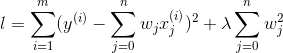
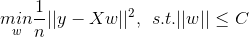
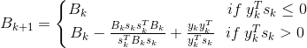
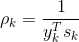
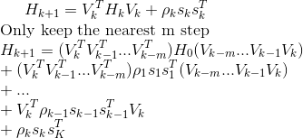

# 岭回归和Lasso回归

都是针对最小二乘法不适合处理特征之间具有相关性的情况, 且都属于正则化的特征选择方法.

## 岭回归模型

岭回归是在方差的基础上增加正则项, 损失函数为: , 其中λ>0.
通过确定λ的值可以使得在方差和偏差之间达到平衡: 随着λ的增大, 模型方差减小而偏差增大.
 从公式直观的来看, 该模型的解会偏向于较小的w, 从凸优化的角度来看, 最小化该公式等价于: 
, 其中C是和λ一一对应的常数.

也就是说, 我们通过限制w的大小实现了对模型空间的限制, 从而在一定程度上(取决于λ的大小)避免了overfitting
, 不过由于Ridge Regression并不具有产生稀疏解的能力, 得到的稀疏w仍然需要数据中的所有特征才能计算预测结果, 
从计算量上来说并没有得到改观.

利用最小二乘法求解岭回归模型的参数时, 首先对W求导, 结果为: 
 

 

## Lasso回归模型
Lasso仍然是一个convex optimization问题, 不过不再具有解析解.它的优良性质是能产生稀疏性解, 导致w中许多项变成零.

Lasso采用L1正则, 即Lasso是在平方差的基础上增加L1正则, 损失函数为:
 

, 其中λ>0 
由于该损失函数在wj=0处不可导, 因此基于梯度下降的方法不适合该损失函数求解, 
因此使用以下近似的优化算法来求解

## 拟牛顿法

拟牛顿法主要是使用一个[Hessian Matrix](https://blog.csdn.net/caimouse/article/details/60465975)的近似矩阵
来代替原来的Hessian Matrix, 通过这种方式来减少运算的复杂度. 其主要过程是先推导出Hessian Matrix需要满足的条件, 
即拟牛顿条件(也可以称为拟牛顿方程). 然后构造一个满足拟牛顿条件的近似矩阵代替原来的Hessian Matrix.

### BFGS和L-BFGS

- BFGS(拟牛顿法)
    - BFGS校正公式为:  

 
    - [BFGS校正公式推导](https://www.cnblogs.com/liuwu265/p/4714396.html)
    
- L-BFGS: 不同于BFGS算法中每次都要存储近似Hesse矩阵Bk-1(在高维数据时, 大量浪费存储空间), 
L-BFGS算法只保存最近的m次迭代信息(因为我们需要的是搜索方向), 这样改进以降低数据所需的存储空间

#### BFGS校正的算法流程

设Bk对称正定, Bk+1由上述的BFGS校正公式确定, 那么Bk+1对称正定的充要条件是
yTksk>0.

在利用[Armijo](https://baike.baidu.com/item/Armijo%E6%9D%A1%E4%BB%B6/3549086)搜索准则时, 并不是都满足上述的充要条件,
 因此公式可变为
  

 
 
算法流程:
- 初始化参数δ∈(0,1), σ∈(0.05), 初始化点x0, 终止误差0≦ε<<1,初始化对称正定矩阵B0.令k:=0.
- 重复以下过程:
    - 计算gk=▽f(xk), 若||gk||≦ε, 退出. 输出xk作为近似极小值点.
    - 解线性方程组得解dk: Bkd=-gk
    - 设mk是满足如下不等式的最小非负整数m:
      
    - 由上述公式确定Bk+1
        - 令k:=k+1
     利用[Sherman-Morrison](https://blog.csdn.net/zhangping1987/article/details/24365455)公式可对上式进行变换, 
    得到: 

 
     
    
#### L-BFGS算法

L-BFGS算法只要保存最新的m步向量即可, 令, 
, 则BFGS算法中的Hk+1可以表示为:
  
    
## 杂谈

- [系统讲解回归区分较好的笔记](https://blog.csdn.net/hzw19920329/article/details/77200475)
- [BFGS校正公式推导](https://www.cnblogs.com/liuwu265/p/4714396.html)