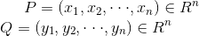

# K-Means算法

## 相似性的度量

一般定义一个距离函数d(X,Y), 利用d(X,Y)来表示样本X和样本Y之间的相似性.

通常使用的距离函数: (假设有两个点P和Q, 它们对应的坐标分别为: 
 

 )
- 闵可夫斯基距离(Minkowski Distance)
    - 点P和点Q之间的闵可夫斯基距离可以定义为:
     

 
- 曼哈顿距离(Manhattan Distance)
    - 点P和点Q之间的曼哈顿距离可以定义为:
     

 
- 欧氏距离(Euclidean Distance)
    - 点P和点Q之间的欧式距离可以定义为:
     

 
    
曼哈顿距离和欧氏距离都是闵可夫斯基距离的具体形式

## K-Means

在进行距离计算之前, 为了避免特征之间的单位不一致问题对度量产生的影响, 应使用均一化预处理数据.

K-Means算法的缺点是: 可能收敛于局部最小值, 在大规模数据中收敛速度慢.不适合处理非球形簇、不同尺寸、不同密度的簇

### 算法原理

算法步骤:
- 初始化常数k,  随机初始化K个聚类中心
    - 缺点:
        - 需要事先知道有多少个类, 局限性较大
        - 随机初始化聚类中心, 对结果影响较大, 多次运行结果差异较大
        
- 重复计算以下过程, 直到聚类中心不再改变
    - 计算每个样本与每个聚类中心之间的相似度, 将样本划分到最相似的类别中
    - 计算划分到每个类别中的所有样本特征的均值, 并将该均值作为每个类新的聚类中心
- 输出最终的聚类中心以及每个样本所属的类别

#### K-Means算法与矩阵分解

假设样本矩阵为m * n矩阵(m个样本, n个特征), 样本有k个类分别为{C1,...,Ck}, 
利用欧式距离计算每一个样本X(i)与k个聚类中心之间的相似度, 并划分至最相似的类别中, 再利用划分后的
类别数据重新计算聚类中心, 重复以上过程, 直到质心不再改变.即:
 

 
其中矩阵Zm×k为0-1矩阵, 当样本j(j∈(0, m-1))属于第i(i∈(0, k-1))类时, zij=1, 否则为0, 
Mk×n为k个聚类中心构成的矩阵.

因此优化目标函数等价于min||X-ZM||2, X为样本, ZM为聚类中心点

- 对于非矩阵形式的目标函数,
- 矩阵形式的目标函数, 

因此对于矩阵和非矩阵形式的目标函数是等价的

## K-Means++

由于K-Means算法中的聚类中心的个数需要事先指定, 存在很大的局限性. K-Means++算法的提出主要是为了能够
在聚类中心的选择过程中选择较优的聚类中心.K-Means算法在聚类中心的初始化过程的基本原则是使得聚类中心的距离尽可能远

### 算法原理

算法步骤:
- 在数据集中随机选择一个样本点作为第一个初始化的聚类中心:
- 选择出其余的聚类中心:
    - 计算样本中的每一个样本点与已经初始化的聚类中心之间的距离, 
    并选择其中最短的距离, 记为d1
    - 以概率选择距离最大的样本作为新的聚类中心, 重复上述过程, 直到k聚类中心都被确定
    - 对k个初始化的聚类中心, 利用K-Means算法计算吗最终的聚类中心
    

## Bisecting K-Means(二分K-Means)

为了克服K-Means算法收敛于局部最小值的问题, Bisecting K-Means的提出.

算法步骤:
- 将所有的样本带你看成是一个簇
- 当簇小于数目k时
    - 对于每一个簇
        - 计算总误差
        - 在给定的簇上进行k-均值聚类, k值为2
        - 计算将该簇划分成两个簇后总误差
    - 选择误差最小的那个簇划分

## 杂谈

- [深度理解K-Means](https://blog.csdn.net/taoyanqi8932/article/details/53727841)

