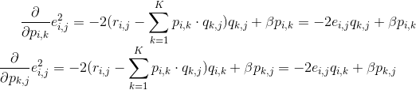
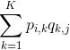

# 基于矩阵分解的推荐算法

基于用户或者基于项的协同过滤推荐算法计算量比较大(基于用户与用户或者项与项之间的相关性), 同时难以实现大数据量下的实时推荐.

基于模型的协同过滤算法有效地解决了实时推荐的问题, 利用历史的用户-商品数据训练得到模型, 并利用该模型实现实时推荐.
矩阵分解(Matrix Factorization, MF)是基于模型的协同过滤算法中的一种.

## Matrix Factorization

基于模型的协同过滤算法大致分为两步:
- 建立模型: 如对用户商品矩阵分解
- 利用训练好的模型进行推荐: 利用分解后的矩阵预测原始矩阵中的未打分项

在基于矩阵分解的推荐算法中, 首先需要建立模型, 即: 将原始的评分矩阵Rm×n分解成两个矩阵Pm×k
和Qk×n的乘积:
 

 

### 损失函数

#### 通过SGD梯度下降最优化损失函数

为了能够求解矩阵Pm×k和Qk×n的每一个元素, 可以利用原始的评分矩阵Rm×n与重新构建的
评分矩阵之间的误差的平方作为损失函数, 即:
 

 
最终, 需要求解所有的非"-"项的损失之和的最小值: 

有了评分矩阵和损失函数, 接下来就是优化算法. 针对平方损失函数的最小值, 可以通过梯度下降法求解, 核心步骤如下:
- 求解损失函数的负梯度:
 

 
- 根据负梯度的方向更新变量:
 

 
通过迭代, 直到算法最终收敛.

#### 损失函数加入正则项

加入正则项后, 对参数进行约束, 从而获得较好的泛化能力. 加入L2正则的损失函数为:
 

 
- 求解损失函数的负梯度:
 

 
- 根据负梯度的方向更新变量:
 

 

### 预测

由训练好的矩阵, 对用户i对商品j的打分预测, 计算公式为: 

## 非负矩阵分解

通常在矩阵分解的过程中, 需要分解后的矩阵的每一项都是非负的, 即:Pm×k≥0, Qk×n≥0, 这便是
非负矩阵分解(Non-negative Matrix Factorization, NMF)的来源

其实就是在矩阵分解的基础上对分解完成的矩阵加上非负的限制条件

### 损失函数, [KL散度](https://blog.csdn.net/xinbolai1993/article/details/78578938?locationNum=4&fps=1)

损失函数除了使用平方损失函数, 还可以使用KL散度, 公式为:
 

 , 
 其中KL散度定义中, D(A||B)≥0, 当且仅当A=B时, 取等号.
 当定义好损失函数后, 求解问题就变成了如下的形式:
- min imize ||R-PQ||2 s.t.P≥0, Q≥0, 平方损失
- min imize D(R||PQ) s.t.P≥0, Q≥0, KL散度损失

KL散度(相对熵)
- 相对熵可以衡量两个随机分布之间的距离,当两个随机分布相同时,它们的相对熵为零，当两个随机分布的差别增大时,
它们的相对熵也会增大.所以相对熵（KL散度）可以用于比较文本的相似度,先统计出词的频率，然后计算KL散度就行了

### 优化问题的求解

为了保证求解过程中P≥0, Q≥0, 可以使用乘法更新规则(Multiplicative Update Rules), 具体操作如下:
- 对于平方距离的损失函数:
 

 
- 对于KL散度的损失函数:
 

 

使用乘法更新规则主要是为了在计算过程中保证非负(基于梯度下降的方法无法保证运算非负), 其实乘法更新规则与基于梯度下降
是等价的

以平方损失函数为例:
- 损失函数及求导为:
 

 
- 按照梯度下降的思路:
 

 

## 杂谈
- [C++的实现](https://blog.csdn.net/winone361/article/details/50705752)