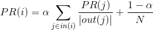
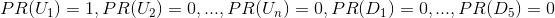

# 基于图的推荐算法

## 二部图与推荐算法

### 二部图

二部图的定义: 在无向图G=\<V,E\>中, 其中V、E分别是无向图中顶点和边的集合. 如果无向图中顶点集合V可分割为两个互不相交的子集
V1, V2, 并且图中每条边(u, v)所关联 的两个顶点u, v分别属于两个不同的顶点集V1, 
V2, 则称无向图G为二部图(Bipartite Graph). 

若V1中的每个顶点都与V2中的所有顶点邻接, 则称G为完全二部图.
- 用于用户-商品模型则就是二部图V1为用户节点, V2为商品节点.

### [PageRank算法](https://www.cnblogs.com/rubinorth/p/5799848.html)

又称为网页排名算法, 通过组合入链数量和网页质量因素两个指标, 使得网页重要性的评价更加准确.
- 入链数量: 其他网页链接本网页的数量. 链接到网页A的链接数越多, 网页A.
- 网页质量: 链接到网页A的原网页越重要, 则网页A也会越重要(质量高的页面会通过链接向其他的页面传递更多的权重).

PageRank的计算方法:
- 将有向图转换成图的邻接矩阵M(矩阵的每一行代表每个节点的出链)
- 计算出链接概率矩阵(即对出链进行归一化)
- 计算概率转移矩阵P(对链接概率矩阵转置, 即得到概率转移矩阵), 可以描述一个用户在网上的下一步的访问行为.
    - 若此时初始化用户对每一个网页节点的访问概率相等, 即矩阵v([1/4 1/4 1/4 1/4]T),
     则用户下一次的访问节点概率为v' = Pv
- 修改概率转移矩阵: 通常用户不可能一直按照链接进行操作, 有时会重新进入新的页面, 即以一定的概率按照转移概率浏览网页节点
.在转移矩阵中加入跳出当前链接的概率α(α通常取0.85)
    - 此时概率转移矩阵变为A = α * P + (1-α) * (p'(p'为m*n矩阵矩阵内元素相等))
- 通过公式v' = Av迭代求解PageRank值

上述PageRank算法, 计算公式为:
 

 
其中, PR(i)表示的是图中i节点的PageRank值, α表示转移概率, N表示的是网页的总数, in(i)表示的是指向网页i的网页集合,
out(j)表示的是网页j指向的网页集合.

计算出的PR值是每个节点相对于全局的重要性程度.

### PersonalRank算法

PersonalRank算法为PageRank算法的变形形式, 用于计算所有的商品节点Dj相对于某个用户节点U的重要性程度.

#### PersonalRank算法流程

PersonalRank算法中, 不区分用户和商品, 因此上述问题由用户对所有商品感兴趣的程度, 变成了对用户U1
计算各个节点的重要程度(包括用户节点和商品节点)
    - 缺陷: 为每个用户进行推荐时, 都需要重新进行迭代推荐.无法实现实时推荐
    
该算法的核心目的是衡量出对某一固定结点，其余结点的重要程度。从而得出推荐顺序。

具体过程如下:
- 初始化: 
- 开始在图上游走, 每次选择PR值不为0的节点开始, 沿着边往前的概率为α, 停在当前点的概率为1-α
- 首先从U1开始, 从U1到D1、D2、和D4的概率为
1/3, 则此时D1、D2和D4的PR值为: 
, U1的PR值变成了1-α
- 此时PR值不为0的节点为U1、D1、D2、D4, 则此时从这三点出发, 
继续上述的过程, 直到收敛为止.
 由此, 可以得出以下的PR计算方法: 
 

 

## 杂谈

- [PersonalRank](https://www.jianshu.com/p/fe2c05933193)
